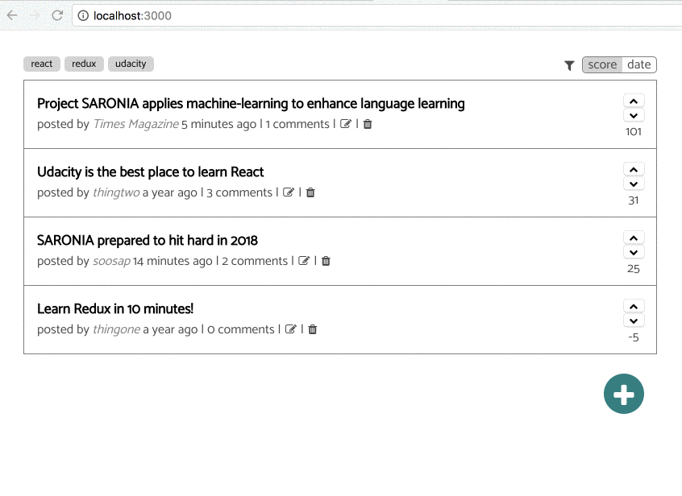

## Install and launch project

* Install and start the API server
    - `cd api-server`
    - `npm install`
    - `node server`
* In another terminal window, start the client app
    - `cd frontend`
    - `npm install`
    - `npm start`

## Technology stack

* react
* redux
* redux-saga
* redux-form
* ramda
* reselect
* flowtype
* styled-components

## Backend API

https://github.com/udacity/reactnd-project-readable-starter/blob/master/api-server/README.md